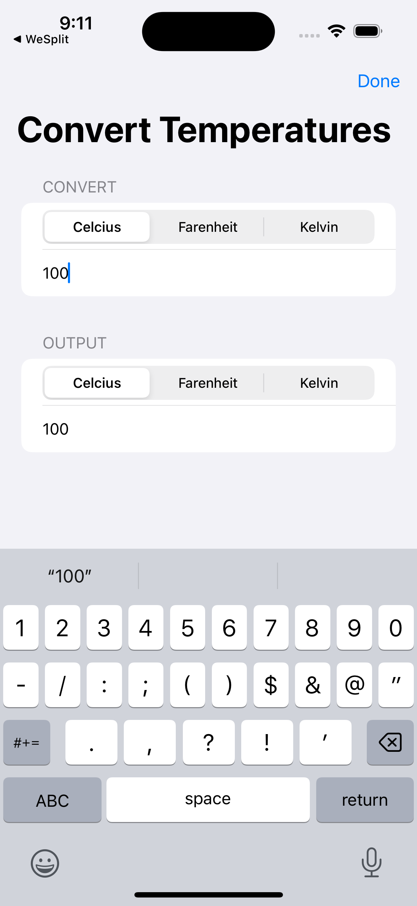
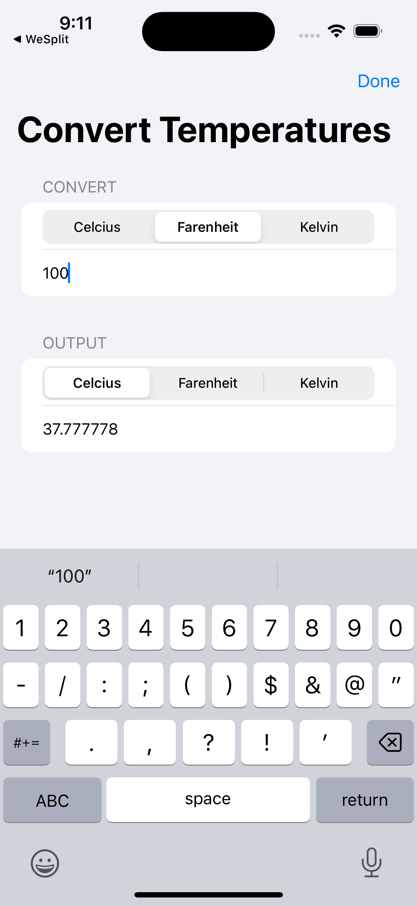

# Scale Swap

This Temperature Converter App was developed as part of the Day 19 challenge of the 100 Days of SwiftUI by Hacking with Swift. Leveraging the knowledge gained from building the Wesplit app, this application employs a segmented picker and a number text field to convert values between different temperature units.

## Features

- **Segmented Picker**: Allows users to select the temperature unit they want to convert from and to.
- **Number TextField**: Enables users to input the value they wish to convert.
- **Conversion Functionality**: Provides accurate conversion between various temperature units.

## How to Use

1. **Select Units**: Use the segmented picker to choose the temperature unit you want to convert from and to.
2. **Enter Value**: Input the numerical value in the text field that you wish to convert.
3. **View Conversion**: The app will instantly display the converted value based on the selected units.

## Technologies Used

- **SwiftUI**: Utilized for building the user interface and handling interactions.
- **Segmented Picker**: Implemented to facilitate easy selection of temperature units.
- **Number TextField**: Integrated for user input of the value to be converted.

## Todo
Expand Conversion: Implement functionality to convert values from other types of metrics like distance, weights, etc.
Add segmented pickers and text fields for selecting and inputting values for different metrics.
- Develop conversion logic for each metric type.
- Integrate UI elements and functionality smoothly into the app.

## Getting Started

To run the Temperature Converter App:
1. Clone this repository.
2. Open the project in Xcode.
3. Build and run the app on a simulator or a physical device.

## Acknowledgments

- **Hacking with Swift**: Provided the 100 Days of SwiftUI challenge, which inspired and guided the development of this application.
- **Wesplit App**: Prior knowledge from building the Wesplit app was instrumental in developing the functionality of this temperature converter.

Certainly! Here's the updated README with a "Screenshots" section to showcase the images you have:

---

# Temperature Converter App

This Temperature Converter App was developed as part of the Day 19 challenge of the 100 Days of SwiftUI by Hacking with Swift. Leveraging the knowledge gained from building the Wesplit app, this application employs a segmented picker and a number text field to convert values between different temperature units.

## Features

- **Segmented Picker**: Allows users to select the temperature unit they want to convert from and to.
- **Number TextField**: Enables users to input the value they wish to convert.
- **Conversion Functionality**: Provides accurate conversion between various temperature units.

## How to Use

1. **Select Units**: Use the segmented picker to choose the temperature unit you want to convert from and to.
2. **Enter Value**: Input the numerical value in the text field that you wish to convert.
3. **View Conversion**: The app will instantly display the converted value based on the selected units.

## Technologies Used

- **SwiftUI**: Utilized for building the user interface and handling interactions.
- **Segmented Picker**: Implemented to facilitate easy selection of temperature units.
- **Number TextField**: Integrated for user input of the value to be converted.

## Todo

- **Expand Conversion**: Implement functionality to convert values from other types of metrics like distance, weights, etc.
    - Add segmented pickers and text fields for selecting and inputting values for different metrics.
    - Develop conversion logic for each metric type.
    - Integrate UI elements and functionality smoothly into the app.

## Screenshots

## Getting Started

To run the Temperature Converter App:
1. Clone this repository.
2. Open the project in Xcode.
3. Build and run the app on a simulator or a physical device.

## Acknowledgments

- **Hacking with Swift**: Provided the 100 Days of SwiftUI challenge, which inspired and guided the development of this application.
- **Wesplit App**: Prior knowledge from building the Wesplit app was instrumental in developing the functionality of this temperature converter.

---

Feel free to adjust the image names or paths if needed and add any additional information or formatting as required!